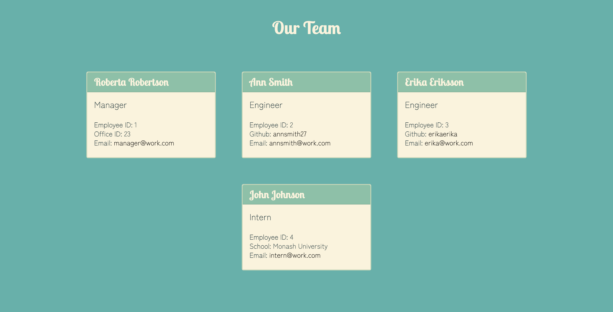

# Team Profile Generator

## Table of Contents
* <a href="#description">Project Description</a>
* <a href="#technologies">Technologies</a>
* <a href="#demonstration">Demonstration </a>
* <a href="#testing">Testing</a>
* <a href="#link">Link </a>
* <a href="#contact">Contact</a>
* <a href="#future-improvements">Future Improvements</a>

## Description
The project allows the user to quickly generate a profile of their work team. The user is asked to input employee details (names, employee ids, email addresses, github profiles etc.). These vary on the type of employee that is selected. Available employee types include manager, engineer and intern. Each team must have one manager, but the composition of the rest of the team is completely under the control of the user. The information input is then converted into a formatted HTML page, which can be found in the /dist folder.

## Technologies:
* Inquirer module
* Jest
* Node js
* Bootstrap CSS Framework

## Demonstration
To view a video demonstration of the application's functionality, please follow <a href="https://drive.google.com/file/d/1jY8vT0S93gxzTnxthgJKyDa9XDyV98LX/view" target="_blank" > this link </a>

The project can be run from the command line. It is invoked using the command "node index.js"

Team profiles generated with this application will be stored as a html file in the /dist folder. The profile will appear similar to the sample image below:

 
 

## Testing
The project underwent unit testing, using the Jest package. All tests passed.

 
 

## Link
The profile generator can be accessed at <a href="https://github.com/ekubik/team-profile-generator" target="_blank"> https://github.com/ekubik/team-profile-generator</a>

## Contact
<a href="mailto:ewa.kubik@hotmail.com" > ewa.kubik@hotmail.com </a>

## Future Improvements
The project could be improved by placing some restrictions on input types - such as preventing the user from entering a null input.
